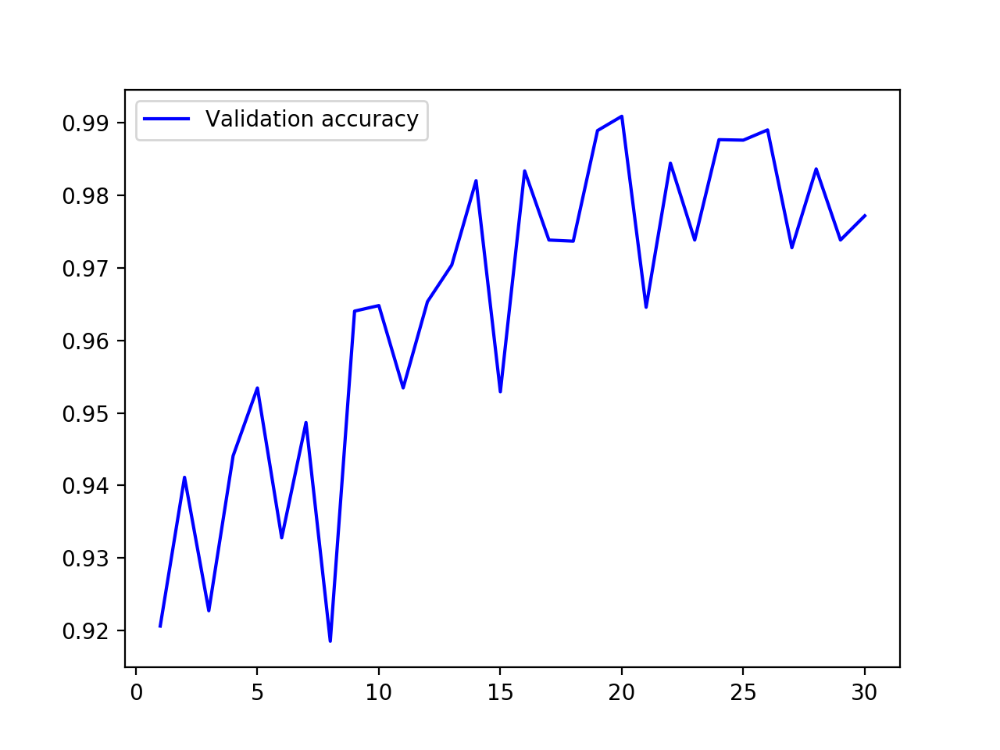

## CNN aerial cactus identification
* Project done for faculty course.
* Project is based on Kaggle competition, [Aerial Cactus Identification](https://www.kaggle.com/c/aerial-cactus-identification)
* Score on competition submission: 0.9020
* Results on validation set, while training:
